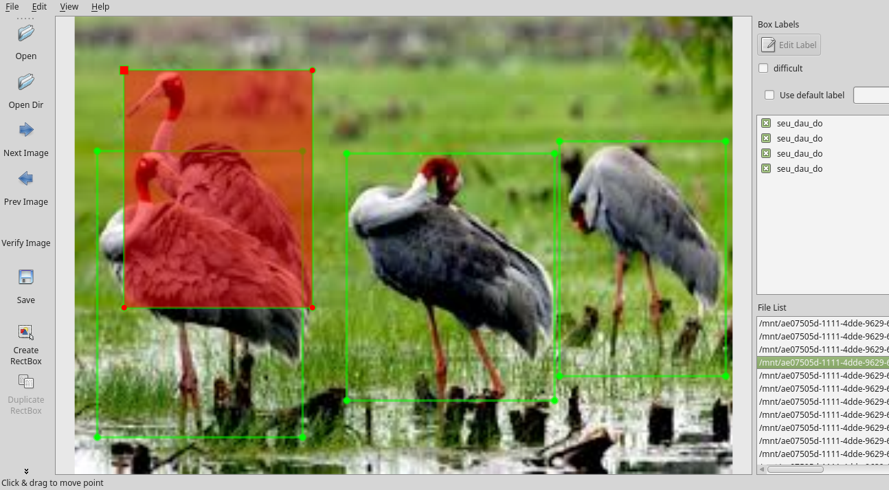

Mô tả quy trình thực hiện bài toán nhận dạng đối tượng trong ảnh, video (tạo tập dữ liệu, train model, đánh gía kết quả train, sử dụng model vào bài toán thực tế)

## Yêu cầu ứng dụng
 Python 3.5, Tensorflow 1.2, OpenCV 3.1 và các thư viện liên quan đến mã nguồn sử dụng

## Xây dựng bộ dữ liệu
- Dữ liệu train được xây dựng theo chuẩn của pascal với 2 classes: sếu đầu đỏ và sao la 
- Sử dụng công cụ [labelImg](https://github.com/tzutalin/labelImg) để tạo bộ dữ liệu train

 
- Toàn bộ dữ liệu train được lưu trong thư mục train/

## Train, test và sử dụng
Sử dụng mã nguồn [darkflow](https://github.com/thtrieu/darkflow) để kết hợp [Tensorflow](https://www.tensorflow.org/), [YOLO](https://pjreddie.com/darknet/yolo/) cho việc sử dụng Deep Learning trên bài toán nhận dạng thực thể trong hình ảnh và video

### Train

```bash
flow --model cfg/tiny-yolo-voc-2c.cfg --load bin/tiny-yolo-voc.weights --train --annotation train/Annotations --dataset train/Image
```
Kết quả log của quá trình train xem ở [train/train-log.txt](https://github.com/tuanemtv/uit-vra/blob/master/train/train-log.txt)

### Test model
```bash
flow --imgdir test_img/ --model cfg/tiny-yolo-voc-2c.cfg --load bin/tiny-yolo-voc.weights --json
```
Các kết quả test có thể xem trong các folder: test_img, sample_img, sign_img

### Sử dụng
Xem thêm hướng dẫn sử dụng [darkflow](https://github.com/thtrieu/darkflow) để biết cách thực hiện tích hợp vào các hệ thống khác.
 
## Mã nguồn liên quan
- http://www.pyimagesearch.com/2016/10/24/ubuntu-16-04-how-to-install-opencv/
- https://www.tensorflow.org/versions/r0.12/get_started/os_setup#pip_installation
- https://pjreddie.com/darknet/yolo/
- https://github.com/thtrieu/darkflow
- http://host.robots.ox.ac.uk/pascal/VOC/
- https://github.com/tzutalin/labelImg
- http://guanghan.info/blog/en/my-works/train-yolo/

